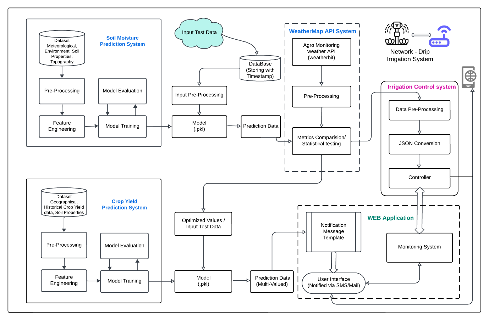
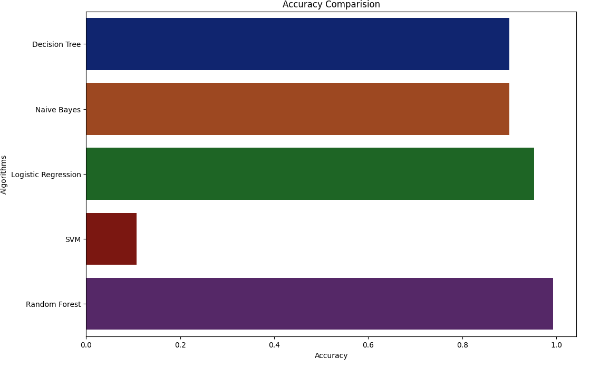
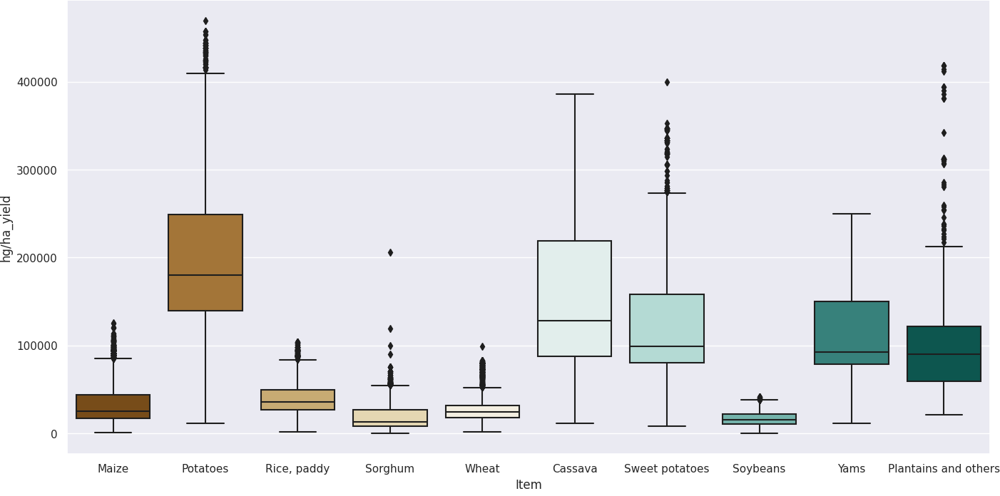
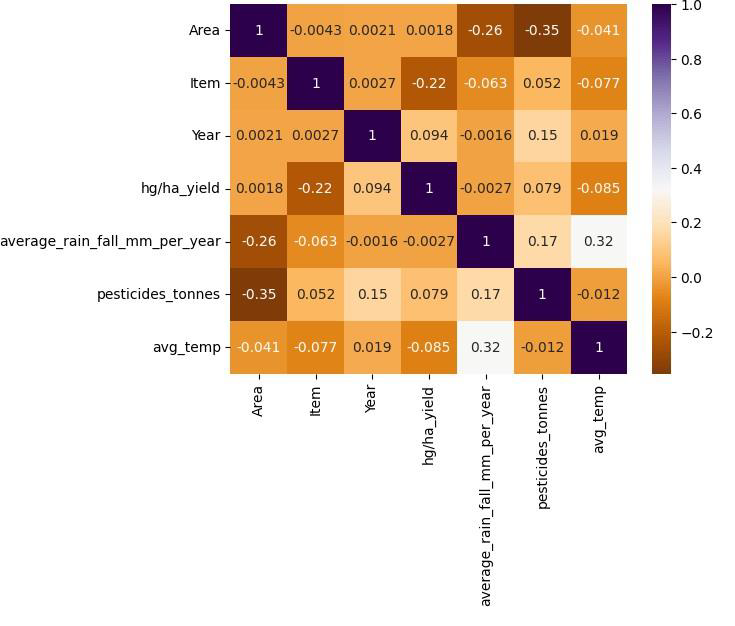
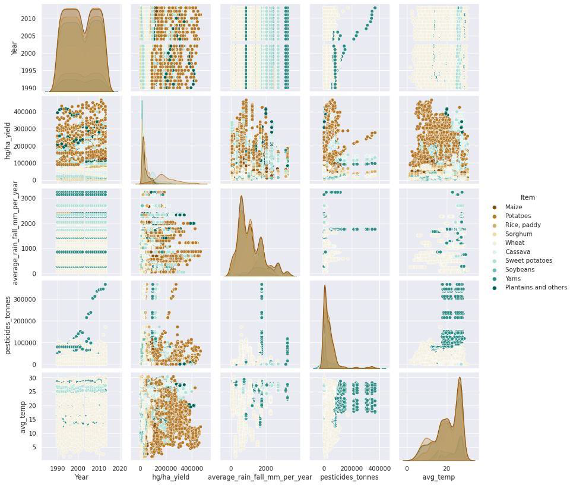
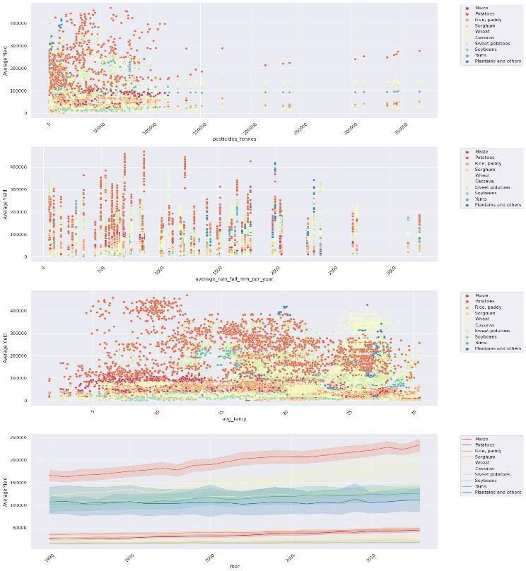
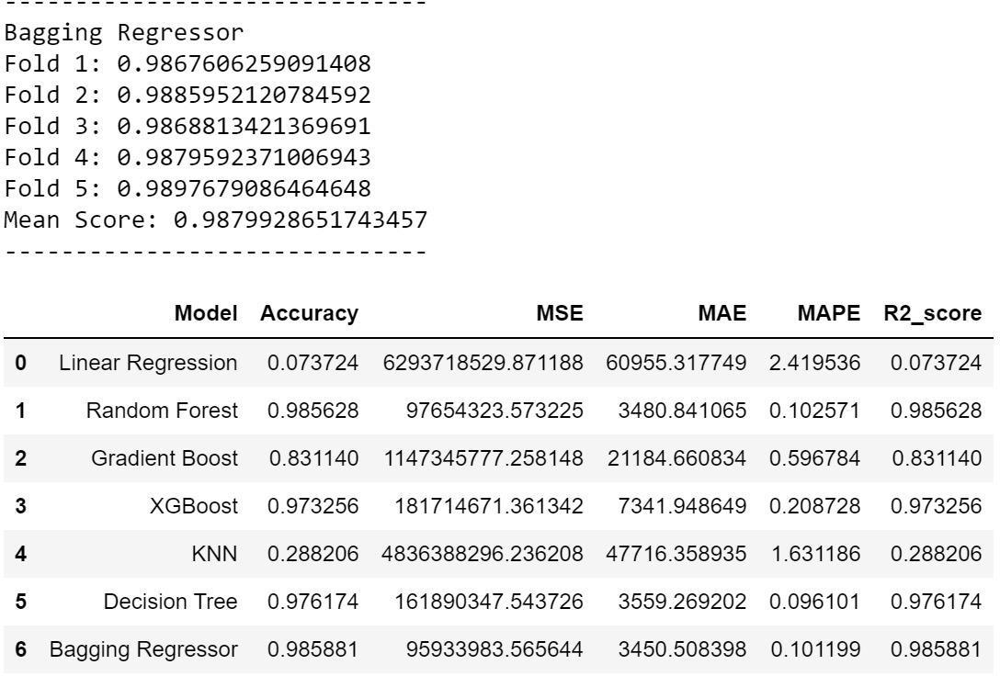

# Crop Recommendation and Yield Prediction System

The **Crop Recommendation and Yield Prediction System** is a comprehensive platform designed to empower farmers with data-driven insights to optimize crop selection and predict yield outcomes. The system integrates user inputs, historical and real-time data, machine learning models, and interactive visualizations to support decision-making in modern agriculture.

## Table of Contents
- [Introduction](#introduction)
- [How It Works](#how-it-works)
- [Project Architecture](#project-architecture)
- [Features](#features)
- [Tech Stack](#tech-stack)
- [Performance Evaluation and Results](#performance-evaluation-and-results)

## Introduction

This project delves into **Precision Agronomy** and **Site-Specific Crop Management (SSCM)**, utilizing **Data Mining** and **Supervised Machine Learning Models** to enhance decision-making in agriculture. By analyzing comprehensive datasets such as soil characteristics, climate conditions, crop health indicators, and yield outcomes, this system helps in optimizing agricultural practices, improving crop yields, and maximizing resource efficiency.

## How It Works

The system provides a user-friendly interface where users can input location-specific parameters such as soil type, climate conditions, and crop preferences. In the backend, the system processes this data alongside historical crop yields, weather patterns, and soil characteristics. It generates crop recommendations and yield predictions using machine learning models, which are visualized through interactive charts and maps.

### Key Features:
- **Crop Recommendation**: Recommends the most suitable crops based on soil, climate, and user preferences.
- **Yield Prediction**: Predicts potential crop yield using historical and real-time data.
- **Customization**: Users can explore various scenarios and refine predictions.
- **Data Visualization**: Heatmaps, scatter plots, and model comparisons for performance evaluation.

## Project Architecture

Below is the architecture diagram showcasing the system components and workflow:

1. **User Input**: Users provide data (e.g., soil nutrients, pH, location).
2. **Weather API**: Fetches real-time weather data using the Weather API.
3. **ML Models**: Performs crop recommendation and yield prediction using supervised machine learning models.
4. **Notifications**: Sends recommendations via Pushbullet notifications.
5. **Database**: Stores data in PostgreSQL for later analysis and retrieval.

## Tech Stack

The project is built using the following technologies:

- **Backend**: Django Rest Framework (DRF)
- **Database**: PostgreSQL
- **Authentication**: Google OAuth
- **Notifications**: Pushbullet for sending notifications to users
- **Weather Data**: WeatherAPI (http://api.weatherapi.com)

## Performance Evaluation and Results

### Crop Recommendation System Evaluation

#### Heat Map on Recommended Crop Feature Sets
The **heatmap** below visualizes the distribution of feature sets used in the crop recommendation system, highlighting their impact on the recommendations.

#### Model Comparison for Crop Recommendation System
Multiple machine learning models were evaluated for crop recommendation tasks, including **Random Forest**, **Logistic Regression**, and **Decision Tree**. As shown in below Figure, Random Forest consistently achieved the highest accuracy and precision.

- **Random Forest**: Best for overall accuracy and precision.
- **Logistic Regression**: Strong alternative in specific conditions.
- **Decision Tree**: Simple yet effective in specific contexts.

### Crop Yield Prediction Analysis

#### Box Plot for Crop Yields
The **box plot** illustrates the variance in crop yields based on historical data and predictions, allowing users to compare actual versus predicted yields.

#### Heatmap for Crop Yield Prediction
A **heatmap** demonstrates the relationship between soil characteristics, weather conditions, and crop yield outcomes.

#### Scatter Plot for Crop Yield Prediction
Multiple **scatter plots** visualize correlations between production factors and yields, offering insights into potential yield optimization strategies.

#### Model Comparison for Crop Yield Prediction
 shows the **model comparison** for predicting crop yields, with a focus on identifying the most reliable and accurate model for forecasting.

